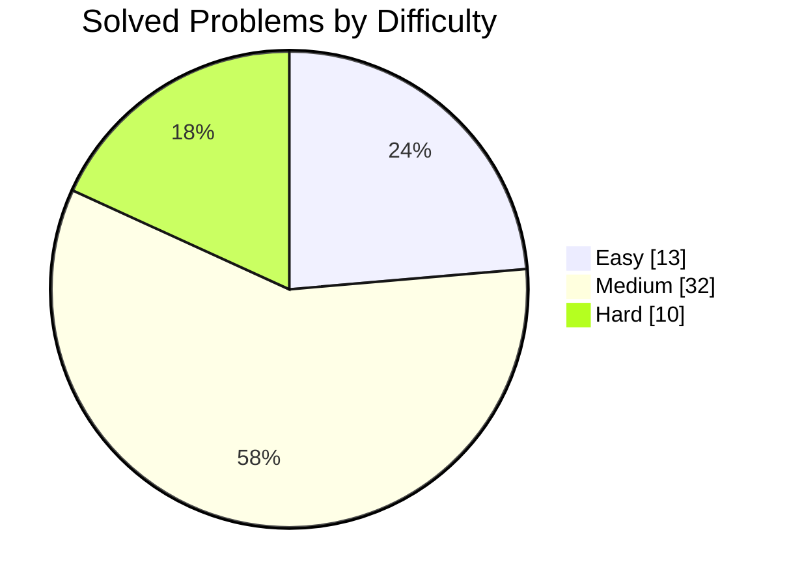
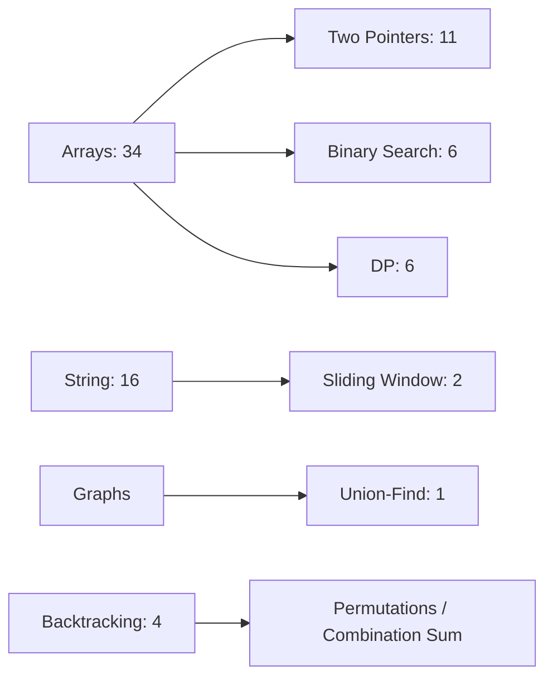
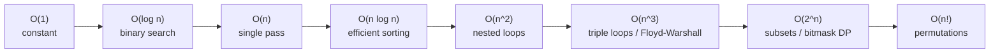

<p align="center">
  
</p>

<p align="center">
  <a href="https://leetcode.com/u/manikantbindass/"></a>
  
  
  
</p>

## Mission

This repository tracks my FAANG-level DSA preparation with Java implementations, pattern notes, and LeetCode progress from [`manikantbindass`](https://leetcode.com/u/manikantbindass/). The goal is simple: build strong recall, clean implementation habits, and interview-ready problem patterns.

## Progress Dashboard

Last synced: 2026-04-23, Asia/Calcutta

| Metric | Progress |
|---|---:|
| Total solved | 55 |
| Goal progress | 55 / 300, 18.3% |
| Easy | 13 solved |
| Medium | 32 solved |
| Hard | 10 solved |
| Failed attempts still open | 2 Hard |
| Global rank | 2,457,782 |






## Repository Map

```text
DSA-Preparation-FAANG-/
|-- Arrays/         Core array, two-pointer, prefix, cyclic placement
|-- Backtracking/   Permutations and combination search
|-- BinarySearch/   Classic sorted-search templates
|-- DP/             Grid DP and stock-state DP
|-- Graphs/         Union-Find and graph traversal patterns
|-- Intervals/      Merge and insert interval patterns
|-- Matrix/         Matrix traversal and in-place marking
|-- Stack/          Monotonic stack problems
|-- Strings/        Sliding window and formatting
|-- Trees/          Tree practice area
|-- Notes/          Pattern notes and cheat sheets
`-- Manikant-DSA-FAANG-Prep/  Daily logs and extra practice structure
```

## Key Concepts

Use this section like quick radio-button tabs: pick a concept, then open its panel to review when the algorithm is useful, common signals, and what to remember in interviews.

| Select | Concept | Best Used For |
|---|---|---|
| ◉ | [Sliding Window](#sliding-window-concept) | Contiguous subarrays/substrings, frequency windows |
| ○ | [Two Pointers](#two-pointers-concept) | Sorted arrays, pairs, partitions, in-place scans |
| ○ | [Binary Search](#binary-search-concept) | Sorted data, answer search, monotonic conditions |
| ○ | [Dynamic Programming](#dynamic-programming-concept) | Overlapping subproblems and repeated choices |
| ○ | [Graphs](#graphs-concept) | Relationships, reachability, shortest paths, components |
| ○ | [Backtracking](#backtracking-concept) | Generate combinations, permutations, subsets, choices |
| ○ | [Monotonic Stack](#monotonic-stack-concept) | Next greater/smaller, histogram, range contribution |
| ○ | [Union-Find](#union-find-concept) | Fast connectivity, grouping, merge/find operations |
| ○ | [Important Algorithms](#important-algorithms) | Interview-ready named algorithms and where to use them |
| ○ | [Algorithm Cheat Sheet](#algorithm-cheat-sheet) | Fast pattern selection during problem solving |
| ○ | [Complexity Graph](#complexity-graph) | Time and space complexity notation reference |

<details id="sliding-window-concept" open>
<summary><strong>Sliding Window</strong></summary>

| What to Know | Details |
|---|---|
| Used when | The problem asks about a contiguous subarray or substring. |
| Signals | "Longest", "shortest", "at most k", "minimum window", repeated character/frequency checks. |
| Core idea | Move the right pointer to expand, move the left pointer to restore validity. |
| Examples | Longest Substring Without Repeating Characters, Substring with Concatenation of All Words. |

</details>

<details id="two-pointers-concept">
<summary><strong>Two Pointers</strong></summary>

| What to Know | Details |
|---|---|
| Used when | You scan from both ends, compare pairs, or compact data in place. |
| Signals | Sorted array, pair sum, palindrome check, remove duplicates, partitioning. |
| Core idea | Move the pointer that can still improve the answer while preserving order or constraints. |
| Examples | Two Sum variants, 4Sum, Remove Duplicates from Sorted Array II. |

</details>

<details id="binary-search-concept">
<summary><strong>Binary Search</strong></summary>

| What to Know | Details |
|---|---|
| Used when | Data is sorted or the answer has a monotonic true/false boundary. |
| Signals | "Find first/last", "minimum possible", "maximum possible", rotated sorted array. |
| Core idea | Keep the half that can still contain the answer and discard the rest. |
| Examples | Search in Rotated Sorted Array II, Find First and Last Position. |

</details>

<details id="dynamic-programming-concept">
<summary><strong>Dynamic Programming</strong></summary>

| What to Know | Details |
|---|---|
| Used when | The same subproblems repeat and choices affect future answers. |
| Signals | "Maximum/minimum ways", "count paths", "choose or skip", grid movement, stock states. |
| Core idea | Define the state clearly, then build transitions from smaller solved states. |
| Examples | Minimum Path Sum, Best Time to Buy and Sell Stock III. |

</details>

<details id="graphs-concept">
<summary><strong>Graphs</strong></summary>

| What to Know | Details |
|---|---|
| Used when | Items have relationships, dependencies, routes, or connected groups. |
| Signals | Nodes/edges, matrix as grid, "can reach", "shortest path", "components". |
| Core idea | Model the relationships first, then choose BFS, DFS, topological sort, or Dijkstra. |
| Examples | Minimize Hamming Distance After Swap Operations. |

</details>

<details id="backtracking-concept">
<summary><strong>Backtracking</strong></summary>

| What to Know | Details |
|---|---|
| Used when | You need to explore all valid choices under constraints. |
| Signals | Permutations, combinations, subsets, search tree, "all possible". |
| Core idea | Choose, recurse, then undo the choice to try the next path. |
| Examples | Permutations, Permutations II, Combination Sum. |

</details>

<details id="monotonic-stack-concept">
<summary><strong>Monotonic Stack</strong></summary>

| What to Know | Details |
|---|---|
| Used when | You need nearest greater/smaller elements or efficient range boundaries. |
| Signals | Histogram area, next greater element, stock span, subarray minimum/maximum contribution. |
| Core idea | Maintain a stack in increasing or decreasing order and pop when the order breaks. |
| Examples | Largest Rectangle in Histogram. |

</details>

<details id="union-find-concept">
<summary><strong>Union-Find</strong></summary>

| What to Know | Details |
|---|---|
| Used when | You repeatedly merge groups and ask whether items are connected. |
| Signals | Components, swaps allowed, connected cities, redundant connection, accounts merge. |
| Core idea | Use parent pointers with path compression and union by rank/size. |
| Examples | Minimize Hamming Distance After Swap Operations. |

</details>

<details id="important-algorithms" open>
<summary><strong>Important Algorithms for Interviews</strong></summary>

### String Algorithms

| Algorithm | Where It Is Used | Best Approach / Key Idea | Typical Complexity |
|---|---|---|---|
| KMP | Pattern search, repeated prefix/suffix matching | Build LPS array to avoid rechecking matched characters | O(n + m) time, O(m) space |
| Rabin-Karp | Multiple pattern checks, rolling substring hash | Compare rolling hashes, verify on collision | O(n + m) average, O(nm) worst |
| Z Algorithm | Pattern matching, prefix similarity, string compression | Compute longest prefix match starting at every index | O(n) time, O(n) space |
| Manacher's Algorithm | Longest palindromic substring | Expand around transformed centers using palindrome radius reuse | O(n) time, O(n) space |
| Trie | Prefix search, word dictionary, autocomplete, XOR queries | Store characters/bits as tree paths | O(word length) per operation |

### Array and Searching Algorithms

| Algorithm | Where It Is Used | Best Approach / Key Idea | Typical Complexity |
|---|---|---|---|
| Binary Search | Sorted arrays, answer search, lower/upper bound | Search the monotonic boundary, not always the exact value | O(log n) |
| Prefix Sum | Range sum, subarray sum, difference between intervals | Precompute cumulative values | O(n) build, O(1) query |
| Difference Array | Range updates, interval increments | Mark start/end deltas, then prefix once | O(n + q) |
| Kadane's Algorithm | Maximum subarray sum | Track best subarray ending at current index | O(n) |
| Quickselect | kth largest/smallest | Partition like quicksort but recurse one side | O(n) average |
| Merge Sort | Stable sorting, inversion count | Divide, sort halves, merge while counting | O(n log n) |
| Counting Sort | Small bounded integer values | Count frequencies instead of comparing | O(n + k) |

### Graph Algorithms

| Algorithm | Where It Is Used | Best Approach / Key Idea | Typical Complexity |
|---|---|---|---|
| BFS | Shortest path in unweighted graph, level order | Queue by distance layers | O(V + E) |
| DFS | Components, cycles, recursion over choices | Explore fully before backtracking | O(V + E) |
| Topological Sort | Course schedule, dependency ordering | Use indegree queue or DFS postorder | O(V + E) |
| Dijkstra | Shortest path with non-negative weights | Greedy min-distance priority queue | O((V + E) log V) |
| Bellman-Ford | Shortest path with negative edges | Relax all edges V - 1 times | O(VE) |
| Floyd-Warshall | All-pairs shortest paths | Try every node as intermediate | O(V^3) |
| Kruskal | Minimum spanning tree | Sort edges, connect with Union-Find | O(E log E) |
| Prim | Minimum spanning tree | Grow tree using min edge heap | O(E log V) |
| Union-Find | Dynamic connectivity, grouping, MST | Path compression plus union by size/rank | Almost O(1) amortized |

### DP Algorithms and Patterns

| Pattern | Where It Is Used | Best Approach / Key Idea | Typical Complexity |
|---|---|---|---|
| Fibonacci DP | Climbing stairs, simple recurrence | Store previous states, often compress to O(1) space | O(n) |
| Grid DP | Paths, minimum path sum, unique paths | Current cell depends on top/left/neighbors | O(rows * cols) |
| Knapsack DP | Choose items under capacity | Decide take/skip for each item and capacity | O(n * capacity) |
| LIS | Longest increasing subsequence | DP O(n^2) or binary-search tails O(n log n) | O(n log n) best |
| LCS/Edit Distance | Compare strings, insert/delete/replace | 2D DP over prefixes | O(nm) |
| Interval DP | Palindromes, matrix chain, burst balloons | Solve smaller intervals before larger intervals | O(n^2) to O(n^3) |
| Bitmask DP | Small n assignment/subset states | Represent chosen set as bits | O(n * 2^n) |

### Greedy Algorithms

| Algorithm / Pattern | Where It Is Used | Best Approach / Key Idea | Typical Complexity |
|---|---|---|---|
| Activity Selection | Maximum non-overlapping intervals | Sort by earliest end time | O(n log n) |
| Interval Merge | Merge ranges, meeting rooms | Sort by start, merge overlapping ranges | O(n log n) |
| Huffman Coding | Optimal prefix codes, merge costs | Repeatedly merge two smallest values | O(n log n) |
| Jump Game Greedy | Reachability, minimum jumps | Track farthest reachable index | O(n) |
| Gas Station | Circular feasibility | Reset start when tank becomes negative | O(n) |
| Fractional Knapsack | Max value with divisible items | Sort by value density | O(n log n) |

### Backtracking Algorithms

| Pattern | Where It Is Used | Best Approach / Key Idea | Typical Complexity |
|---|---|---|---|
| Subsets | Generate all possible include/exclude choices | Choose or skip each item | O(2^n) |
| Permutations | All orderings | Swap/visited array, avoid duplicates with sorting | O(n * n!) |
| Combination Sum | Pick numbers with constraints | Recurse with current index and remaining target | Exponential |
| N-Queens | Constraint placement | Track used columns and diagonals | Exponential |
| Sudoku Solver | Constraint satisfaction | Fill the most constrained empty cell first | Exponential |

</details>

<details id="algorithm-cheat-sheet" open>
<summary><strong>Algorithm Cheat Sheet</strong></summary>

| If You See This | Think This First | Why |
|---|---|---|
| Sorted array or monotonic answer | Binary Search | Cuts search space in half |
| Contiguous subarray/substring | Sliding Window or Prefix Sum | Maintains range efficiently |
| Pair/triplet in sorted data | Two Pointers | Avoids nested loops |
| "Maximum/minimum subarray" | Kadane or DP | Tracks best ending here |
| "All possible" results | Backtracking | Explores choice tree |
| Repeated choices with optimal answer | Dynamic Programming | Stores overlapping subproblems |
| Dependencies or ordering | Topological Sort | Resolves prerequisite order |
| Shortest path, equal weights | BFS | First visit gives shortest distance |
| Shortest path, positive weights | Dijkstra | Greedy closest-node expansion |
| Connected groups / allowed swaps | Union-Find | Fast component merge and lookup |
| Prefix dictionary / word search | Trie | Character-by-character branching |
| Palindrome substring | Expand Around Center; Manacher for optimal | Center expansion is simple, Manacher is O(n) |
| Next greater/smaller | Monotonic Stack | Keeps useful candidates only |
| Repeated range updates | Difference Array | Converts many updates into one prefix pass |
| kth largest/smallest | Heap or Quickselect | Heap is stable O(n log k), quickselect is average O(n) |

### Problem Solving Flow

```text
1. Read constraints first.
2. Identify the pattern: array, string, graph, tree, DP, greedy, backtracking.
3. Start with brute force and name the bottleneck.
4. Replace the bottleneck with a known tool: hash map, sort, heap, prefix, DP, graph traversal.
5. Prove the invariant: what stays true after every loop/recursive call?
6. Test edge cases: empty, one item, duplicates, negative values, max constraints.
7. State complexity clearly before final submission.
```

</details>

<details id="complexity-graph" open>
<summary><strong>Time and Space Complexity Graph</strong></summary>



| Notation | Common Source | Good For | Watch Out |
|---|---|---|---|
| O(1) | Direct math, hash lookup average | Constant-time checks | Hash collisions are rare but possible |
| O(log n) | Binary search, balanced trees | Huge sorted search spaces | Needs sorted/monotonic property |
| O(n) | One pass, BFS/DFS over nodes and edges | Most interview-optimal scans | Hidden work inside substring/copy can add cost |
| O(n log n) | Sorting, heap operations over n items | Sorting-based interview solutions | Often acceptable for 10^5 elements |
| O(n^2) | Pair checks, 2D DP | Medium constraints, matrix work | Too slow for 10^5 |
| O(n^3) | Triple loops, Floyd-Warshall, interval DP | Small n only | Usually fails unless n is tiny |
| O(2^n) | Subsets, bitmask DP | n around 20 or less | Exponential growth |
| O(n!) | Permutations, exhaustive ordering | n around 10 or less | Explodes fastest |

</details>

## Topic Summaries

### Dynamic Programming

DP is about turning repeated choices into stored state. The important skill is defining what one state means before writing loops.

| Pattern | What to Remember | Example in Repo |
|---|---|---|
| Grid DP | Current cell depends on top/left or neighboring states | [MinimumPathSum.java](DP/MinimumPathSum.java) |
| Buy/Sell State DP | Track hold/sell states after each transaction | [BestTimeToBuyAndSellStockIII.java](DP/BestTimeToBuyAndSellStockIII.java) |
| 1D Optimization | Compress rows when only previous state is needed | Practice target |
| Subsequence DP | Compare include/exclude or matching characters | Practice target |
| Knapsack DP | Choose item or skip item under capacity | Practice target |

### Trees

Tree problems usually become clear after choosing the traversal and deciding what each recursive call returns.

| Pattern | What to Remember | Status |
|---|---|---|
| DFS Recursion | Return height, sum, validity, or best path from subtree | Practice target |
| BFS Level Order | Queue-based level processing for shortest depth and views | Practice target |
| BST Invariant | Left subtree smaller, right subtree larger | Practice target |
| LCA | Use recursion to bubble up matching nodes | Practice target |
| Serialization | Preserve structure with null markers or level order | Practice target |

### Graphs

Graph questions are about modeling relationships, then picking traversal or connectivity tools.

| Pattern | What to Remember | Example in Repo |
|---|---|---|
| Union-Find | Fast component merging and lookup | [MinimizeHammingDistanceAfterSwapOperations.java](Graphs/MinimizeHammingDistanceAfterSwapOperations.java) |
| BFS | Shortest path in unweighted graphs | Practice target |
| DFS | Connected components, cycle detection, flood fill | Practice target |
| Topological Sort | Directed dependency order with indegrees or DFS states | Practice target |
| Dijkstra | Weighted shortest path with priority queue | Practice target |

## Recently Added LeetCode Solutions

These solution files cover the latest public accepted submissions exposed by LeetCode for the profile. LeetCode publicly exposes the latest accepted submission metadata and language, while the profile count confirms 55 total solved problems. Source code is not public through LeetCode's profile API, so language versions here are repo-maintained solutions unless a LeetCode export is added.

| Problem | Topic Folder | Solution |
|---|---|---|
| Words Within Two Edits of Dictionary | Strings | [Java](Strings/WordsWithinTwoEditsOfDictionary.java) |
| Count and Say | Strings | [Go](Strings/CountAndSay.go) |
| Substring with Concatenation of All Words | Strings | [Java](Strings/SubstringWithConcatenationOfAllWords.java), [Go](Strings/SubstringWithConcatenationOfAllWords.go), [Python](Strings/SubstringWithConcatenationOfAllWords.py) |
| Minimize Hamming Distance After Swap Operations | Graphs | [Java](Graphs/MinimizeHammingDistanceAfterSwapOperations.java) |
| Spiral Matrix II | Matrix | [Java](Matrix/SpiralMatrixII.java) |
| Insert Interval | Intervals | [Java](Intervals/InsertInterval.java), [Go](Intervals/InsertInterval.go) |
| Merge Intervals | Intervals | [Java](Intervals/MergeIntervals.java) |
| Search a 2D Matrix | Matrix | [Java](Matrix/SearchA2DMatrix.java), [Go](Matrix/SearchA2DMatrix.go) |
| Text Justification | Strings | [Java](Strings/TextJustification.java) |
| Plus One | Arrays | [Java](Arrays/PlusOne.java) |
| Permutations II | Backtracking | [Java](Backtracking/PermutationsII.java) |
| Permutations | Backtracking | [Java](Backtracking/Permutations.java) |
| Remove Duplicates from Sorted Array II | Arrays | [Java](Arrays/RemoveDuplicatesFromSortedArrayII.java) |
| First Missing Positive | Arrays | [Java](Arrays/FirstMissingPositive.java) |
| Search in Rotated Sorted Array II | BinarySearch | [Java](BinarySearch/SearchInRotatedSortedArrayII.java) |
| 4Sum | Arrays | [Java](Arrays/FourSum.java) |
| Largest Rectangle in Histogram | Stack | [Java](Stack/LargestRectangleInHistogram.java) |
| Set Matrix Zeroes | Matrix | [Java](Matrix/SetMatrixZeroes.java), [Go](Matrix/SetMatrixZeroes.go) |
| Find First and Last Position of Element in Sorted Array | BinarySearch | [Java](BinarySearch/FindFirstAndLastPositionOfElementInSortedArray.java) |
| Combination Sum | Backtracking | [Java](Backtracking/CombinationSum.java) |
| Best Time to Buy and Sell Stock III | DP | [Java](DP/BestTimeToBuyAndSellStockIII.java) |
| Merge Sorted Array | Arrays | [Java](Arrays/MergeSortedArray.java) |
| Minimum Path Sum | DP | [Java](DP/MinimumPathSum.java), [C++](DP/MinimumPathSum.cpp) |

## LeetCode Stats

| Difficulty | Solved | Total LeetCode Questions | Platform Coverage |
|---|---:|---:|---:|
| Easy | 13 | 938 | 1.4% |
| Medium | 32 | 2,044 | 1.6% |
| Hard | 10 | 924 | 1.1% |
| All | 55 | 3,906 | 1.4% |

| Language | Problems Solved |
|---|---:|
| Java | 47 |
| Go | 8 |
| C++ | 1 |
| Python | 1 |

## Topic Coverage From LeetCode Tags

| Topic | Problems Solved | Topic | Problems Solved |
|---|---:|---|---:|
| Array | 34 | String | 16 |
| Two Pointers | 11 | Math | 8 |
| Hash Table | 8 | Sorting | 7 |
| Binary Search | 6 | Dynamic Programming | 6 |
| Linked List | 5 | Recursion | 5 |
| Matrix | 5 | Stack | 4 |
| Backtracking | 4 | Simulation | 3 |
| Divide and Conquer | 2 | Monotonic Stack | 2 |
| Trie | 1 | Union-Find | 1 |
| Greedy | 1 | Depth-First Search | 1 |
| Sliding Window | 2 | Bit Manipulation | 1 |

## Pattern Checklist

| Pattern | Use Case | Current Focus |
|---|---|---|
| Sliding Window | Contiguous subarrays and substrings in O(n) | Strings |
| Two Pointers | Sorted arrays, pairs, triplets, partitioning | Arrays |
| Binary Search | Search-space reduction in O(log n) | Rotated arrays |
| Monotonic Stack | Next smaller/greater and histogram area | Stack |
| Backtracking | Permutations, subsets, combinations | Search trees |
| Union-Find | Connected components and swappable groups | Graphs |
| Dynamic Programming | Reused subproblems and state transitions | Grid and stock DP |

## Resources

- [NeetCode.io](https://neetcode.io)
- [Striver's A2Z DSA Course](https://takeuforward.org/strivers-a2z-dsa-course/)
- [LeetCode](https://leetcode.com)
- [GeeksforGeeks](https://www.geeksforgeeks.org/)

<p align="center">
  
</p>
