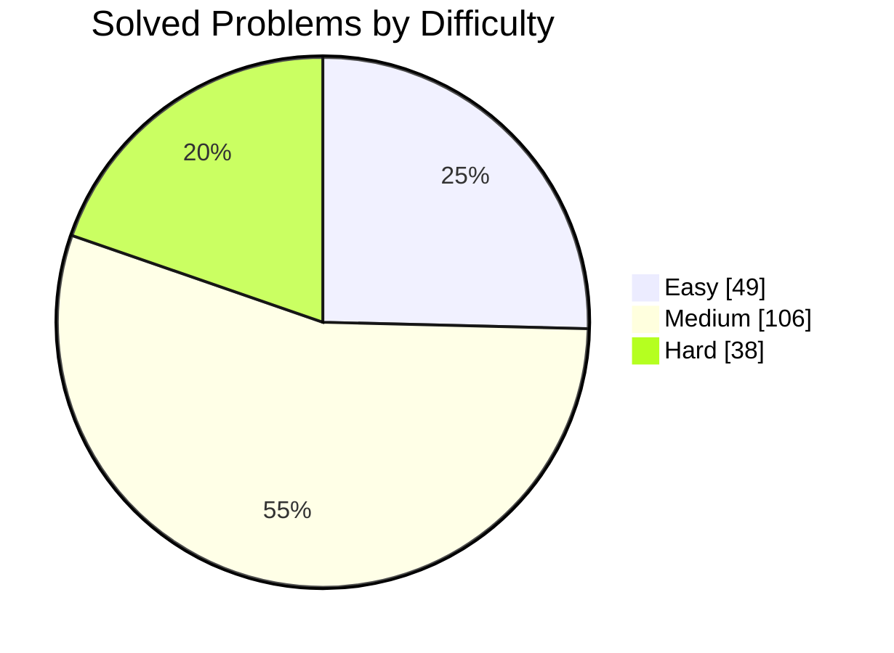
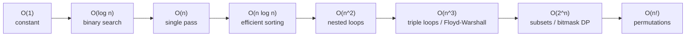

<p align="center">
  
</p>

<p align="center">
  <a href="https://leetcode.com/u/manikantbindass/"></a>
  
  
  
</p>

## Mission

This repository tracks my FAANG-level DSA preparation with Java implementations, pattern notes, and LeetCode progress from [`manikantbindass`](https://leetcode.com/u/manikantbindass/). The goal is simple: build strong recall, clean implementation habits, and interview-ready problem patterns.

## Progress Dashboard

<!-- LEETCODE-STATS:START -->
Last synced: 2026-06-04 15:19 UTC

### 🚀 LeetCode Stats


| Metric | Progress |
|---|---:|
| Rank | 821,573 |
| Solved | 193 |
| Easy | 49 |
| Medium | 106 |
| Hard | 38 |
| Goal progress | 193 / 300, 64.3% |



```mermaid
pie showData
    title Solved Problems by Difficulty
    "Easy" : 49
    "Medium" : 106
    "Hard" : 38
```
<!-- LEETCODE-STATS:END -->

## Repository Map

```text
DSA-Preparation-FAANG-/
|-- Arrays/         Core array, two-pointer, prefix, cyclic placement
|-- Backtracking/   Permutations and combination search
|-- BinarySearch/   Classic sorted-search templates
|-- DP/             Grid DP and stock-state DP
|-- Graphs/         Union-Find and graph traversal patterns
|-- Intervals/      Merge and insert interval patterns
|-- Matrix/         Matrix traversal and in-place marking
|-- Stack/          Monotonic stack problems
|-- Strings/        Sliding window and formatting
|-- Trees/          Tree practice area
|-- Notes/          Pattern notes and cheat sheets
|-- resources/      Jupyter notebook guide for core interview algorithms
`-- Manikant-DSA-FAANG-Prep/  Daily logs and extra practice structure
```

## Key Concepts

Use this section like quick radio-button tabs: pick a concept, then open its panel to review when the algorithm is useful, common signals, and what to remember in interviews.

| Select | Concept | Best Used For |
|---|---|---|
| ◉ | [Sliding Window](#sliding-window-concept) | Contiguous subarrays/substrings, frequency windows |
| ○ | [Two Pointers](#two-pointers-concept) | Sorted arrays, pairs, partitions, in-place scans |
| ○ | [Binary Search](#binary-search-concept) | Sorted data, answer search, monotonic conditions |
| ○ | [Dynamic Programming](#dynamic-programming-concept) | Overlapping subproblems and repeated choices |
| ○ | [Graphs](#graphs-concept) | Relationships, reachability, shortest paths, components |
| ○ | [Backtracking](#backtracking-concept) | Generate combinations, permutations, subsets, choices |
| ○ | [Monotonic Stack](#monotonic-stack-concept) | Next greater/smaller, histogram, range contribution |
| ○ | [Union-Find](#union-find-concept) | Fast connectivity, grouping, merge/find operations |
| ○ | [Important Algorithms](#important-algorithms) | Interview-ready named algorithms and where to use them |
| ○ | [Algorithm Cheat Sheet](#algorithm-cheat-sheet) | Fast pattern selection during problem solving |
| ○ | [Complexity Graph](#complexity-graph) | Time and space complexity notation reference |

<details id="sliding-window-concept" open>
<summary><strong>Sliding Window</strong></summary>

| What to Know | Details |
|---|---|
| Used when | The problem asks about a contiguous subarray or substring. |
| Signals | "Longest", "shortest", "at most k", "minimum window", repeated character/frequency checks. |
| Core idea | Move the right pointer to expand, move the left pointer to restore validity. |
| Examples | Longest Substring Without Repeating Characters, Substring with Concatenation of All Words. |

</details>

<details id="two-pointers-concept">
<summary><strong>Two Pointers</strong></summary>

| What to Know | Details |
|---|---|
| Used when | You scan from both ends, compare pairs, or compact data in place. |
| Signals | Sorted array, pair sum, palindrome check, remove duplicates, partitioning. |
| Core idea | Move the pointer that can still improve the answer while preserving order or constraints. |
| Examples | Two Sum variants, 4Sum, Remove Duplicates from Sorted Array II. |

</details>

<details id="binary-search-concept">
<summary><strong>Binary Search</strong></summary>

| What to Know | Details |
|---|---|
| Used when | Data is sorted or the answer has a monotonic true/false boundary. |
| Signals | "Find first/last", "minimum possible", "maximum possible", rotated sorted array. |
| Core idea | Keep the half that can still contain the answer and discard the rest. |
| Examples | Search in Rotated Sorted Array II, Find First and Last Position. |

</details>

<details id="dynamic-programming-concept">
<summary><strong>Dynamic Programming</strong></summary>

| What to Know | Details |
|---|---|
| Used when | The same subproblems repeat and choices affect future answers. |
| Signals | "Maximum/minimum ways", "count paths", "choose or skip", grid movement, stock states. |
| Core idea | Define the state clearly, then build transitions from smaller solved states. |
| Examples | Minimum Path Sum, Best Time to Buy and Sell Stock III. |

</details>

<details id="graphs-concept">
<summary><strong>Graphs</strong></summary>

| What to Know | Details |
|---|---|
| Used when | Items have relationships, dependencies, routes, or connected groups. |
| Signals | Nodes/edges, matrix as grid, "can reach", "shortest path", "components". |
| Core idea | Model the relationships first, then choose BFS, DFS, topological sort, or Dijkstra. |
| Examples | Minimize Hamming Distance After Swap Operations, Word Ladder. |

</details>

<details id="backtracking-concept">
<summary><strong>Backtracking</strong></summary>

| What to Know | Details |
|---|---|
| Used when | You need to explore all valid choices under constraints. |
| Signals | Permutations, combinations, subsets, search tree, "all possible". |
| Core idea | Choose, recurse, then undo the choice to try the next path. |
| Examples | Permutations, Permutations II, Combination Sum, Generate Parentheses. |

</details>

<details id="monotonic-stack-concept">
<summary><strong>Monotonic Stack</strong></summary>

| What to Know | Details |
|---|---|
| Used when | You need nearest greater/smaller elements or efficient range boundaries. |
| Signals | Histogram area, next greater element, stock span, subarray minimum/maximum contribution. |
| Core idea | Maintain a stack in increasing or decreasing order and pop when the order breaks. |
| Examples | Largest Rectangle in Histogram. |

</details>

<details id="union-find-concept">
<summary><strong>Union-Find</strong></summary>

| What to Know | Details |
|---|---|
| Used when | You repeatedly merge groups and ask whether items are connected. |
| Signals | Components, swaps allowed, connected cities, redundant connection, accounts merge. |
| Core idea | Use parent pointers with path compression and union by rank/size. |
| Examples | Minimize Hamming Distance After Swap Operations. |

</details>

<details id="important-algorithms" open>
<summary><strong>Important Algorithms for Interviews</strong></summary>

### String Algorithms

| Algorithm | Where It Is Used | Best Approach / Key Idea | Typical Complexity |
|---|---|---|---|
| KMP | Pattern search, repeated prefix/suffix matching | Build LPS array to avoid rechecking matched characters | O(n + m) time, O(m) space |
| Rabin-Karp | Multiple pattern checks, rolling substring hash | Compare rolling hashes, verify on collision | O(n + m) average, O(nm) worst |
| Z Algorithm | Pattern matching, prefix similarity, string compression | Compute longest prefix match starting at every index | O(n) time, O(n) space |
| Manacher's Algorithm | Longest palindromic substring | Expand around transformed centers using palindrome radius reuse | O(n) time, O(n) space |
| Trie | Prefix search, word dictionary, autocomplete, XOR queries | Store characters/bits as tree paths | O(word length) per operation |

### Array Algorithms

| Algorithm | Where It Is Used | Best Approach / Key Idea | Typical Complexity |
|---|---|---|---|
| Prefix Sum | Range sum, subarray sum, difference between intervals | Precompute cumulative values | O(n) build, O(1) query |
| Difference Array | Range updates, interval increments | Mark start/end deltas, then prefix once | O(n + q) |
| Kadane's Algorithm | Maximum subarray sum | Track best subarray ending at current index | O(n) |
| Quickselect | kth largest/smallest | Partition like quicksort but recurse one side | O(n) average |

### Sorting Algorithms

| Algorithm | Where It Is Used | Best Approach / Key Idea | Typical Complexity |
|---|---|---|---|
| Merge Sort | Stable sorting, inversion count | Divide, sort halves, merge while counting | O(n log n) |
| Quick Sort | General sorting, partition-based thinking | Pick pivot, partition smaller/larger, recurse | O(n log n) average, O(n^2) worst |
| Heap Sort | In-place guaranteed sorting, heap practice | Build heap, repeatedly extract max/min | O(n log n) |
| Counting Sort | Small bounded integer values | Count frequencies instead of comparing | O(n + k) |
| Radix Sort | Large integer/string keys with fixed digit length | Sort by each digit using stable counting sort | O(d * (n + b)) |
| Bucket Sort | Uniformly distributed values | Put values into buckets, sort each bucket | O(n + k) average |

### Searching Algorithms

| Algorithm | Where It Is Used | Best Approach / Key Idea | Typical Complexity |
|---|---|---|---|
| Linear Search | Unsorted small input, simple scans | Check every element once | O(n) |
| Binary Search | Sorted arrays, answer search, lower/upper bound | Search the monotonic boundary, not always the exact value | O(log n) |
| Ternary Search | Unimodal functions, peak/minimum over continuous/discrete range | Compare two midpoints and discard one side | O(log n) |
| BFS Search | Shortest path in unweighted state space | Explore states level by level | O(V + E) |
| DFS Search | Exhaustive path search, components, recursion trees | Explore one branch fully before returning | O(V + E) |
| A* Search | Pathfinding with heuristic, grids, games | Prioritize `cost_so_far + estimated_remaining` | Depends on heuristic |

### Divide and Conquer Algorithms

| Algorithm | Where It Is Used | Best Approach / Key Idea | Typical Complexity |
|---|---|---|---|
| Merge Sort | Sorting, inversion count, linked-list sort | Split, solve halves, combine in sorted order | O(n log n) |
| Quickselect | kth largest/smallest, median finding | Partition and recurse only into needed side | O(n) average |
| Binary Search | Search on sorted data or answer range | Use monotonic condition to discard half | O(log n) |
| Closest Pair of Points | Computational geometry distance problems | Sort by x, solve halves, check middle strip | O(n log n) |
| Fast Exponentiation | Power, modular exponentiation | Square base and halve exponent | O(log exponent) |
| Karatsuba Multiplication | Big integer multiplication | Split numbers and reduce multiplication count | O(n^1.585) |

### Graph Algorithms

| Algorithm | Where It Is Used | Best Approach / Key Idea | Typical Complexity |
|---|---|---|---|
| BFS | Shortest path in unweighted graph, level order | Queue by distance layers | O(V + E) |
| DFS | Components, cycles, recursion over choices | Explore fully before backtracking | O(V + E) |
| Topological Sort | Course schedule, dependency ordering | Use indegree queue or DFS postorder | O(V + E) |
| Dijkstra | Shortest path with non-negative weights | Greedy min-distance priority queue | O((V + E) log V) |
| Bellman-Ford | Shortest path with negative edges | Relax all edges V - 1 times | O(VE) |
| Floyd-Warshall | All-pairs shortest paths | Try every node as intermediate | O(V^3) |
| Kruskal | Minimum spanning tree | Sort edges, connect with Union-Find | O(E log E) |
| Prim | Minimum spanning tree | Grow tree using min edge heap | O(E log V) |
| Union-Find | Dynamic connectivity, grouping, MST | Path compression plus union by size/rank | Almost O(1) amortized |

### DP Algorithms and Patterns

| Pattern | Where It Is Used | Best Approach / Key Idea | Typical Complexity |
|---|---|---|---|
| Fibonacci DP | Climbing stairs, simple recurrence | Store previous states, often compress to O(1) space | O(n) |
| Grid DP | Paths, minimum path sum, unique paths | Current cell depends on top/left/neighbors | O(rows * cols) |
| Knapsack DP | Choose items under capacity | Decide take/skip for each item and capacity | O(n * capacity) |
| LIS | Longest increasing subsequence | DP O(n^2) or binary-search tails O(n log n) | O(n log n) best |
| LCS/Edit Distance | Compare strings, insert/delete/replace | 2D DP over prefixes | O(nm) |
| Interval DP | Palindromes, matrix chain, burst balloons | Solve smaller intervals before larger intervals | O(n^2) to O(n^3) |
| Bitmask DP | Small n assignment/subset states | Represent chosen set as bits | O(n * 2^n) |

### Greedy Algorithms

| Algorithm / Pattern | Where It Is Used | Best Approach / Key Idea | Typical Complexity |
|---|---|---|---|
| Activity Selection | Maximum non-overlapping intervals | Sort by earliest end time | O(n log n) |
| Interval Merge | Merge ranges, meeting rooms | Sort by start, merge overlapping ranges | O(n log n) |
| Huffman Coding | Optimal prefix codes, merge costs | Repeatedly merge two smallest values | O(n log n) |
| Jump Game Greedy | Reachability, minimum jumps | Track farthest reachable index | O(n) |
| Gas Station | Circular feasibility | Reset start when tank becomes negative | O(n) |
| Fractional Knapsack | Max value with divisible items | Sort by value density | O(n log n) |

### Backtracking Algorithms

| Pattern | Where It Is Used | Best Approach / Key Idea | Typical Complexity |
|---|---|---|---|
| Subsets | Generate all possible include/exclude choices | Choose or skip each item | O(2^n) |
| Permutations | All orderings | Swap/visited array, avoid duplicates with sorting | O(n * n!) |
| Combination Sum | Pick numbers with constraints | Recurse with current index and remaining target | Exponential |
| N-Queens | Constraint placement | Track used columns and diagonals | Exponential |
| Sudoku Solver | Constraint satisfaction | Fill the most constrained empty cell first | Exponential |

### Number Theory Algorithms

| Algorithm | Where It Is Used | Best Approach / Key Idea | Typical Complexity |
|---|---|---|---|
| Sieve of Eratosthenes | Generate primes up to n | Mark multiples of each prime | O(n log log n) |
| Euclidean GCD | GCD/LCM, fraction simplification | Repeatedly replace `(a, b)` with `(b, a % b)` | O(log min(a, b)) |
| Extended Euclid | Modular inverse, Diophantine equations | Track coefficients while computing GCD | O(log n) |
| Modular Exponentiation | Large powers under modulo | Binary exponentiation with modulo each step | O(log exponent) |
| Fermat's Little Theorem | Modular inverse when mod is prime | `a^(mod-2) % mod` for inverse | O(log mod) |
| Prime Factorization | Divisor count, factor-based problems | Divide by primes up to sqrt(n) | O(sqrt n) basic |
| Chinese Remainder Theorem | Combine modular equations | Merge congruences with coprime moduli | O(k log n) |

### Bit Manipulation Algorithms

| Algorithm / Trick | Where It Is Used | Best Approach / Key Idea | Typical Complexity |
|---|---|---|---|
| XOR Single Number | Find unique value among pairs | `a ^ a = 0`, `a ^ 0 = a` | O(n) |
| Bitmask Subsets | Enumerate all subsets of small n | Treat each bit as choose/not choose | O(n * 2^n) |
| Brian Kernighan's Count | Count set bits | Repeatedly clear lowest set bit with `x &= x - 1` | O(number of set bits) |
| Check Power of Two | Math/bit check | `n > 0 && (n & (n - 1)) == 0` | O(1) |
| Bitmask DP | Assignment, TSP-style small n | State is the selected set of items | O(n * 2^n) |
| Prefix XOR | Range XOR, subarray XOR | Store cumulative XOR values | O(n) build, O(1) query |

### Computational Geometry Algorithms

| Algorithm | Where It Is Used | Best Approach / Key Idea | Typical Complexity |
|---|---|---|---|
| Orientation / Cross Product | Turn direction, segment intersection | Sign of cross product tells clockwise/counterclockwise | O(1) |
| Line Segment Intersection | Geometry validation, sweep-line basics | Combine orientation tests and bounding checks | O(1) per pair |
| Convex Hull - Graham Scan | Outer boundary of points | Sort by angle, maintain left turns with stack | O(n log n) |
| Convex Hull - Monotonic Chain | Outer boundary, easier implementation | Sort points, build lower and upper hulls | O(n log n) |
| Sweep Line | Overlaps, intersections, closest events | Sort events and maintain active set | O(n log n) often |
| Shoelace Formula | Polygon area | Sum cross products of adjacent vertices | O(n) |
| Closest Pair of Points | Minimum distance among points | Divide and conquer with middle strip | O(n log n) |

### Advanced Algorithms

| Algorithm | Where It Is Used | Best Approach / Key Idea | Typical Complexity |
|---|---|---|---|
| Segment Tree | Range query with updates | Store interval answers in a tree | O(log n) query/update |
| Fenwick Tree | Prefix sums with updates | Use lowest set bit to jump ranges | O(log n) query/update |
| Sparse Table | Static range min/max/gcd queries | Precompute powers of two intervals | O(n log n) build, O(1) query |
| Tarjan's SCC | Strongly connected components | DFS low-link values | O(V + E) |
| Kosaraju's SCC | Strongly connected components | DFS order, reverse graph, DFS again | O(V + E) |
| Lowest Common Ancestor | Tree ancestor queries | Binary lifting or Euler tour + RMQ | O(log n) query |
| Kahn's Algorithm | Topological sort | Queue zero-indegree nodes | O(V + E) |
| Min-Cost / Max-Flow | Matching, assignment, network capacity | Repeated augmenting paths or Dinic variants | Varies by method |
| Dinic's Algorithm | Maximum flow | BFS level graph + DFS blocking flow | O(V^2 E) common bound |
| Aho-Corasick | Multiple pattern matching | Trie plus failure links | O(text + total pattern length + matches) |

</details>

<details id="algorithm-cheat-sheet" open>
<summary><strong>Algorithm Cheat Sheet</strong></summary>

| If You See This | Think This First | Why |
|---|---|---|
| Sorted array or monotonic answer | Binary Search | Cuts search space in half |
| Contiguous subarray/substring | Sliding Window or Prefix Sum | Maintains range efficiently |
| Pair/triplet in sorted data | Two Pointers | Avoids nested loops |
| "Maximum/minimum subarray" | Kadane or DP | Tracks best ending here |
| "All possible" results | Backtracking | Explores choice tree |
| Repeated choices with optimal answer | Dynamic Programming | Stores overlapping subproblems |
| Dependencies or ordering | Topological Sort | Resolves prerequisite order |
| Shortest path, equal weights | BFS | First visit gives shortest distance |
| Shortest path, positive weights | Dijkstra | Greedy closest-node expansion |
| Connected groups / allowed swaps | Union-Find | Fast component merge and lookup |
| Prefix dictionary / word search | Trie | Character-by-character branching |
| Palindrome substring | Expand Around Center; Manacher for optimal | Center expansion is simple, Manacher is O(n) |
| Next greater/smaller | Monotonic Stack | Keeps useful candidates only |
| Repeated range updates | Difference Array | Converts many updates into one prefix pass |
| kth largest/smallest | Heap or Quickselect | Heap is stable O(n log k), quickselect is average O(n) |

### Problem Solving Flow

```text
1. Read constraints first.
2. Identify the pattern: array, string, graph, tree, DP, greedy, backtracking.
3. Start with brute force and name the bottleneck.
4. Replace the bottleneck with a known tool: hash map, sort, heap, prefix, DP, graph traversal.
5. Prove the invariant: what stays true after every loop/recursive call?
6. Test edge cases: empty, one item, duplicates, negative values, max constraints.
7. State complexity clearly before final submission.
```

</details>

<details id="complexity-graph" open>
<summary><strong>Time and Space Complexity Graph</strong></summary>


```mermaid
flowchart LR
    A["O(1)<br/>constant"] --> B["O(log n)<br/>binary search"]
    B --> C["O(n)<br/>single pass"]
    C --> D["O(n log n)<br/>efficient sorting"]
    D --> E["O(n^2)<br/>nested loops"]
    E --> F["O(n^3)<br/>triple loops / Floyd-Warshall"]
    F --> G["O(2^n)<br/>subsets / bitmask DP"]
    G --> H["O(n!)<br/>permutations"]
```

| Notation | Common Source | Good For | Watch Out |
|---|---|---|---|
| O(1) | Direct math, hash lookup average | Constant-time checks | Hash collisions are rare but possible |
| O(log n) | Binary search, balanced trees | Huge sorted search spaces | Needs sorted/monotonic property |
| O(n) | One pass, BFS/DFS over nodes and edges | Most interview-optimal scans | Hidden work inside substring/copy can add cost |
| O(n log n) | Sorting, heap operations over n items | Sorting-based interview solutions | Often acceptable for 10^5 elements |
| O(n^2) | Pair checks, 2D DP | Medium constraints, matrix work | Too slow for 10^5 |
| O(n^3) | Triple loops, Floyd-Warshall, interval DP | Small n only | Usually fails unless n is tiny |
| O(2^n) | Subsets, bitmask DP | n around 20 or less | Exponential growth |
| O(n!) | Permutations, exhaustive ordering | n around 10 or less | Explodes fastest |

</details>

## Topic Summaries

### Dynamic Programming

DP is about turning repeated choices into stored state. The important skill is defining what one state means before writing loops.

| Pattern | What to Remember | Example in Repo |
|---|---|---|
| Grid DP | Current cell depends on top/left or neighboring states | [MinimumPathSum.java](DP/MinimumPathSum.java) |
| Buy/Sell State DP | Track hold/sell states after each transaction | [BestTimeToBuyAndSellStockIII.java](DP/BestTimeToBuyAndSellStockIII.java) |
| 1D Optimization | Compress rows when only previous state is needed | Practice target |
| Subsequence DP | Compare include/exclude or matching characters | Practice target |
| Knapsack DP | Choose item or skip item under capacity | Practice target |

### Trees

Tree problems usually become clear after choosing the traversal and deciding what each recursive call returns.

| Pattern | What to Remember | Status |
|---|---|---|
| DFS Recursion | Return height, sum, validity, or best path from subtree | Practice target |
| BFS Level Order | Queue-based level processing for shortest depth and views | Practice target |
| BST Invariant | Left subtree smaller, right subtree larger | Practice target |
| LCA | Use recursion to bubble up matching nodes | Practice target |
| Serialization | Preserve structure with null markers or level order | Practice target |

### Graphs

Graph questions are about modeling relationships, then picking traversal or connectivity tools.

| Pattern | What to Remember | Example in Repo |
|---|---|---|
| Union-Find | Fast component merging and lookup | [MinimizeHammingDistanceAfterSwapOperations.java](Graphs/MinimizeHammingDistanceAfterSwapOperations.java) |
| BFS | Shortest path in unweighted graphs | [WordLadder.java](Graphs/WordLadder.java) |
| DFS | Connected components, cycle detection, flood fill | Practice target |
| Topological Sort | Directed dependency order with indegrees or DFS states | Practice target |
| Dijkstra | Weighted shortest path with priority queue | Practice target |

## Recently Added LeetCode Solutions

These solution files cover the latest public accepted submissions exposed by LeetCode for the profile. LeetCode publicly exposes the latest accepted submission metadata and language, while this repository currently includes 128 repo-maintained solved problems across 382 solution files. Source code is not public through LeetCode's profile API, so language versions here are repo-maintained solutions unless a LeetCode export is added.

| Problem | Topic Folder | Solution |
|---|---|---|
| Find the Length of the Longest Common Prefix | Strings | [Java](Strings/LengthOfLongestCommonPrefix.java), [Python](Strings/LengthOfLongestCommonPrefix.py), [Go](Strings/LengthOfLongestCommonPrefix.go) |
| Decode Ways | DP | [Java](DP/DecodeWays.java), [Python](DP/DecodeWays.py), [Go](DP/DecodeWays.go) |
| Reverse Linked List II | LinkedList | [Java](LinkedList/ReverseLinkedListII.java), [Python](LinkedList/ReverseLinkedListII.py), [Go](LinkedList/ReverseLinkedListII.go) |
| Restore IP Addresses | Backtracking | [Java](Backtracking/RestoreIPAddresses.java), [Python](Backtracking/RestoreIPAddresses.py), [Go](Backtracking/RestoreIPAddresses.go) |
| Check if Array Is Sorted and Rotated | Arrays | [Java](Arrays/CheckIfArrayIsSortedAndRotated.java), [Python](Arrays/CheckIfArrayIsSortedAndRotated.py), [Go](Arrays/CheckIfArrayIsSortedAndRotated.go) |
| Binary Tree Inorder Traversal | Trees | [Java](Trees/BinaryTreeInorderTraversal.java), [Python](Trees/BinaryTreeInorderTraversal.py), [Go](Trees/BinaryTreeInorderTraversal.go) |
| Unique Binary Search Trees II | Trees | [Java](Trees/UniqueBinarySearchTreesII.java), [Python](Trees/UniqueBinarySearchTreesII.py), [Go](Trees/UniqueBinarySearchTreesII.go) |
| Jump Game V | DP | [Java](DP/JumpGameV_1340.java), [Python](DP/JumpGameV_1340.py), [Go](DP/JumpGameV_1340.go) |
| Unique Binary Search Trees | DP | [Java](DP/UniqueBinarySearchTrees_96.java), [Python](DP/UniqueBinarySearchTrees_96.py), [Go](DP/UniqueBinarySearchTrees_96.go) |
| Interleaving String | DP | [Java](DP/InterleavingString.java), [Python](DP/InterleavingString.py), [Go](DP/InterleavingString.go) |
| Jump Game VII | DP | [Java](DP/JumpGameVII.java), [Python](DP/JumpGameVII.py), [Go](DP/JumpGameVII.go) |
| Validate Binary Search Tree | Trees | [Java](Trees/ValidateBinarySearchTree.java), [Python](Trees/ValidateBinarySearchTree.py), [Go](Trees/ValidateBinarySearchTree.go) |
| Recover Binary Search Tree | Trees | [Java](Trees/RecoverBinarySearchTree.java), [Python](Trees/RecoverBinarySearchTree.py), [Go](Trees/RecoverBinarySearchTree.go) |
| Count the Number of Special Characters I | Strings | [Java](Strings/CountTheNumberOfSpecialCharactersI.java), [Python](Strings/CountTheNumberOfSpecialCharactersI.py), [Go](Strings/CountTheNumberOfSpecialCharactersI.go) |
| Same Tree | Trees | [Java](Trees/SameTree.java), [Python](Trees/SameTree.py), [Go](Trees/SameTree.go) |
| Count the Number of Special Characters II | Strings | [Java](Strings/CountTheNumberOfSpecialCharactersII.java), [Python](Strings/CountTheNumberOfSpecialCharactersII.py), [Go](Strings/CountTheNumberOfSpecialCharactersII.go) |
| Symmetric Tree | Trees | [Java](Trees/SymmetricTree.java), [Python](Trees/SymmetricTree.py), [Go](Trees/SymmetricTree.go) |
| Binary Tree Level Order Traversal | Trees | [Java](Trees/BinaryTreeLevelOrderTraversal.java), [Python](Trees/BinaryTreeLevelOrderTraversal.py), [Go](Trees/BinaryTreeLevelOrderTraversal.go) |
| Longest Common Suffix Queries | Strings | [Java](Strings/LongestCommonSuffixQueries.java), [Python](Strings/LongestCommonSuffixQueries.py), [Go](Strings/LongestCommonSuffixQueries.go) |
| Binary Tree Zigzag Level Order Traversal | Trees | [Java](Trees/BinaryTreeZigzagLevelOrderTraversal.java), [Python](Trees/BinaryTreeZigzagLevelOrderTraversal.py), [Go](Trees/BinaryTreeZigzagLevelOrderTraversal.go) |
| Maximum Depth of Binary Tree | Trees | [Java](Trees/MaximumDepthOfBinaryTree.java), [Python](Trees/MaximumDepthOfBinaryTree.py), [Go](Trees/MaximumDepthOfBinaryTree.go) |
| Minimum Element After Replacement With Digit Sum | Arrays | [Java](Arrays/MinimumElementAfterReplacementWithDigitSum.java), [Python](Arrays/MinimumElementAfterReplacementWithDigitSum.py), [Go](Arrays/MinimumElementAfterReplacementWithDigitSum.go) |
| Binary Tree Level Order Traversal II | Trees | [Java](Trees/BinaryTreeLevelOrderTraversalII.java), [Python](Trees/BinaryTreeLevelOrderTraversalII.py), [Go](Trees/BinaryTreeLevelOrderTraversalII.go) |
| Convert Sorted List to Binary Search Tree | Trees | [Java](Trees/ConvertSortedListToBinarySearchTree.java), [Python](Trees/ConvertSortedListToBinarySearchTree.py), [Go](Trees/ConvertSortedListToBinarySearchTree.go) |
| Block Placement Queries | BinarySearch | [Java](BinarySearch/BlockPlacementQueries.java), [Python](BinarySearch/BlockPlacementQueries.py), [Go](BinarySearch/BlockPlacementQueries.go) |
| Balanced Binary Tree | Trees | [Java](Trees/BalancedBinaryTree.java), [Python](Trees/BalancedBinaryTree.py), [Go](Trees/BalancedBinaryTree.go) |
| Minimum Depth of Binary Tree | Trees | [Java](Trees/MinimumDepthOfBinaryTree.java), [Python](Trees/MinimumDepthOfBinaryTree.py), [Go](Trees/MinimumDepthOfBinaryTree.go) |
| Minimum Initial Energy to Finish Tasks | Arrays | [Java](Arrays/MinimumInitialEnergyToFinishTasks.java), [Python](Arrays/MinimumInitialEnergyToFinishTasks.py), [Go](Arrays/MinimumInitialEnergyToFinishTasks.go) |
| Minimum Moves to Make Array Complementary | Arrays | [Java](Arrays/MinimumMovesToMakeArrayComplementary.java), [Python](Arrays/MinimumMovesToMakeArrayComplementary.py), [Go](Arrays/MinimumMovesToMakeArrayComplementary.go) |
| Check if Array is Good | Arrays | [Java](Arrays/CheckIfArrayIsGood.java), [Python](Arrays/CheckIfArrayIsGood.py), [Go](Arrays/CheckIfArrayIsGood.go) |
| Scramble String | Strings | [Java](Strings/ScrambleString.java), [Python](Strings/ScrambleString.py), [Go](Strings/ScrambleString.go) |
| Find Minimum in Rotated Sorted Array | BinarySearch | [Java](BinarySearch/FindMinimumInRotatedSortedArray.java), [Python](BinarySearch/FindMinimumInRotatedSortedArray.py), [Go](BinarySearch/FindMinimumInRotatedSortedArray.go) |
| Sqrt(x) | BinarySearch | [Java](BinarySearch/SqrtX.java), [Python](BinarySearch/SqrtX.py), [Go](BinarySearch/SqrtX.go) |
| Find Minimum in Rotated Sorted Array II | BinarySearch | [Java](BinarySearch/FindMinimumInRotatedSortedArrayII.java), [Python](BinarySearch/FindMinimumInRotatedSortedArrayII.py), [Go](BinarySearch/FindMinimumInRotatedSortedArrayII.go) |
| Climbing Stairs | DP | [Java](DP/ClimbingStairs.java), [Python](DP/ClimbingStairs.py), [Go](DP/ClimbingStairs.go) |
| Jump Game III | Graphs | [Java](Graphs/JumpGameIII.java), [Python](Graphs/JumpGameIII.py), [Go](Graphs/JumpGameIII.go) |
| Combinations | Backtracking | [Java](Backtracking/Combinations.java), [Python](Backtracking/Combinations.py), [Go](Backtracking/Combinations.go) |
| Valid Perfect Square | BinarySearch | [Java](BinarySearch/ValidPerfectSquare.java), [Python](BinarySearch/ValidPerfectSquare.py), [Go](BinarySearch/ValidPerfectSquare.go) |
| Jump Game IV | Graphs | [Java](Graphs/JumpGameIV.java), [Python](Graphs/JumpGameIV.py), [Go](Graphs/JumpGameIV.go) |
| Minimum Common Value | Arrays | [Java](Arrays/MinimumCommonValue.java), [Python](Arrays/MinimumCommonValue.py), [Go](Arrays/MinimumCommonValue.go) |
| Remove Duplicates from Sorted List II | LinkedList | [Java](LinkedList/RemoveDuplicatesFromSortedListII.java), [Python](LinkedList/RemoveDuplicatesFromSortedListII.py), [Go](LinkedList/RemoveDuplicatesFromSortedListII.go) |
| Remove Duplicates from Sorted List | LinkedList | [Java](LinkedList/RemoveDuplicatesFromSortedList.java), [Python](LinkedList/RemoveDuplicatesFromSortedList.py), [Go](LinkedList/RemoveDuplicatesFromSortedList.go) |
| Find the Prefix Common Array of Two Arrays | Arrays | [Java](Arrays/FindThePrefixCommonArrayOfTwoArrays.java), [Python](Arrays/FindThePrefixCommonArrayOfTwoArrays.py), [Go](Arrays/FindThePrefixCommonArrayOfTwoArrays.go) |
| Partition List | LinkedList | [Java](LinkedList/PartitionList.java), [Python](LinkedList/PartitionList.py), [Go](LinkedList/PartitionList.go) |
| Gray Code | Math | [Java](Math/GrayCode.java), [Python](Math/GrayCode.py), [Go](Math/GrayCode.go) |
| Squares of a Sorted Array | Arrays | [Java](Arrays/SquaresOfASortedArray.java), [Python](Arrays/SquaresOfASortedArray.py), [Go](Arrays/SquaresOfASortedArray.go) |
| Perfect Squares | DP | [Java](DP/PerfectSquares.java), [Python](DP/PerfectSquares.py), [Go](DP/PerfectSquares.go) |
| Separate the Digits in an Array | Arrays | [Java](Arrays/SeparateTheDigitsInAnArray.java), [Python](Arrays/SeparateTheDigitsInAnArray.py), [Go](Arrays/SeparateTheDigitsInAnArray.go) |
| Maximum Number of Jumps to Reach the Last Index | DP | [Java](DP/MaximumNumberOfJumpsToReachTheLastIndex.java), [Python](DP/MaximumNumberOfJumpsToReachTheLastIndex.py), [Go](DP/MaximumNumberOfJumpsToReachTheLastIndex.go) |
| Permutation Sequence | Math | [Java](Math/PermutationSequence.java), [Python](Math/PermutationSequence.py), [Go](Math/PermutationSequence.go) |
| Add Binary | Strings | [Java](Strings/AddBinary.java), [Python](Strings/AddBinary.py), [Go](Strings/AddBinary.go) |
| Cyclically Rotating a Grid | Matrix | [Java](Matrix/CyclicallyRotatingAGrid.java), [Python](Matrix/CyclicallyRotatingAGrid.py), [Go](Matrix/CyclicallyRotatingAGrid.go) |
| Valid Number | Strings | [Java](Strings/ValidNumber.java), [Python](Strings/ValidNumber.py), [Go](Strings/ValidNumber.go) |
| Unique Paths | DP | [Java](DP/UniquePaths.java), [Python](DP/UniquePaths.py), [Go](DP/UniquePaths.go) |
| Minimum Jumps to Reach End via Prime Teleportation | Graphs | [Java](Graphs/MinimumJumpsToReachEndViaPrimeTeleportation.java), [Python](Graphs/MinimumJumpsToReachEndViaPrimeTeleportation.py), [Go](Graphs/MinimumJumpsToReachEndViaPrimeTeleportation.go) |
| Pow(x, n) | Math | [Java](Math/PowXN.java), [Python](Math/PowXN.py), [Go](Math/PowXN.go) |
| N-Queens II | Backtracking | [Java](Backtracking/NQueensII.java), [Python](Backtracking/NQueensII.py), [Go](Backtracking/NQueensII.go) |
| Jump Game IX | Arrays | [Java](Arrays/JumpGameIX.java), [Python](Arrays/JumpGameIX.py), [Go](Arrays/JumpGameIX.go) |
| Wildcard Matching | DP | [Java](DP/WildcardMatching.java), [Python](DP/WildcardMatching.py), [Go](DP/WildcardMatching.go) |
| Length of Last Word | Strings | [Java](Strings/LengthOfLastWord.java), [Python](Strings/LengthOfLastWord.py), [Go](Strings/LengthOfLastWord.go) |
| Rotating the Box | Matrix | [Java](Matrix/RotatingTheBox.java), [Python](Matrix/RotatingTheBox.py), [Go](Matrix/RotatingTheBox.go) |
| Pascal's Triangle II | Arrays | [Java](Arrays/PascalsTriangleII.java), [Python](Arrays/PascalsTriangleII.py), [Go](Arrays/PascalsTriangleII.go) |
| Best Time to Buy and Sell Stock | Arrays | [Java](Arrays/BestTimeToBuyAndSellStock.java), [Python](Arrays/BestTimeToBuyAndSellStock.py), [Go](Arrays/BestTimeToBuyAndSellStock.go) |
| Rotate List | LinkedList | [Java](LinkedList/RotateList.java), [Python](LinkedList/RotateList.py), [Go](LinkedList/RotateList.go) |
| Pascal's Triangle | Arrays | [Java](Arrays/PascalsTriangle.java), [Python](Arrays/PascalsTriangle.py), [Go](Arrays/PascalsTriangle.go) |
| Triangle | DP | [Java](DP/Triangle.java), [Python](DP/Triangle.py), [Go](DP/Triangle.go) |
| Rotate String | Strings | [Java](Strings/RotateString.java), [Python](Strings/RotateString.py), [Go](Strings/RotateString.go) |
| Construct Binary Tree from Inorder and Postorder Traversal | Trees | [Java](Trees/ConstructBinaryTreeFromInorderAndPostorderTraversal.java), [Python](Trees/ConstructBinaryTreeFromInorderAndPostorderTraversal.py), [Go](Trees/ConstructBinaryTreeFromInorderAndPostorderTraversal.go) |
| Convert Sorted Array to Binary Search Tree | Trees | [Java](Trees/ConvertSortedArrayToBinarySearchTree.java), [Python](Trees/ConvertSortedArrayToBinarySearchTree.py), [Go](Trees/ConvertSortedArrayToBinarySearchTree.go) |
| Rotated Digits | Arrays | [Java](Arrays/RotatedDigits.java), [Python](Arrays/RotatedDigits.py), [Go](Arrays/RotatedDigits.go) |
| Subsets II | Backtracking | [Java](Backtracking/SubsetsII.java), [Python](Backtracking/SubsetsII.py), [Go](Backtracking/SubsetsII.go) |
| Construct Binary Tree from Preorder and Inorder Traversal | Trees | [Java](Trees/ConstructBinaryTreeFromPreorderAndInorderTraversal.java), [Python](Trees/ConstructBinaryTreeFromPreorderAndInorderTraversal.py), [Go](Trees/ConstructBinaryTreeFromPreorderAndInorderTraversal.go) |
| Rotate Function | Arrays | [Java](Arrays/RotateFunction.java), [Python](Arrays/RotateFunction.py), [Go](Arrays/RotateFunction.go) |
| Unique Paths II | DP | [Java](DP/UniquePathsII.java), [Python](DP/UniquePathsII.py), [Go](DP/UniquePathsII.go) |
| Jump Game | Arrays | [Java](Arrays/JumpGame.java), [Python](Arrays/JumpGame.py), [Go](Arrays/JumpGame.go) |
| Maximum Path Score in a Grid | DP | [Java](DP/MaximumPathScoreInAGrid.java), [Python](DP/MaximumPathScoreInAGrid.py), [Go](DP/MaximumPathScoreInAGrid.go) |
| Sudoku Solver | Backtracking | [Java](Backtracking/SudokuSolver.java), [Python](Backtracking/SudokuSolver.py), [Go](Backtracking/SudokuSolver.go) |
| Spiral Matrix | Matrix | [Java](Matrix/SpiralMatrix.java), [Python](Matrix/SpiralMatrix.py), [Go](Matrix/SpiralMatrix.go) |
| Maximum Score From Grid Operations | DP | [Java](DP/MaximumScoreFromGridOperations.java), [Python](DP/MaximumScoreFromGridOperations.py), [Go](DP/MaximumScoreFromGridOperations.go) |
| N-Queens | Backtracking | [Java](Backtracking/NQueens.java), [Python](Backtracking/NQueens.py), [Go](Backtracking/NQueens.go) |
| Maximum Subarray | Arrays | [Java](Arrays/MaximumSubarray.java), [Python](Arrays/MaximumSubarray.py), [Go](Arrays/MaximumSubarray.go) |
| Minimum Operations to Make a Uni-Value Grid | Matrix | [Java](Matrix/MinimumOperationsToMakeAUniValueGrid.java), [Python](Matrix/MinimumOperationsToMakeAUniValueGrid.py), [Go](Matrix/MinimumOperationsToMakeAUniValueGrid.go) |
| Remove Nth Node From End of List | LinkedList | [Java](LinkedList/RemoveNthNodeFromEndOfList.java), [Python](LinkedList/RemoveNthNodeFromEndOfList.py), [Go](LinkedList/RemoveNthNodeFromEndOfList.go) |
| Find the Index of the First Occurrence in a String | Strings | [Java](Strings/FindTheIndexOfTheFirstOccurrenceInAString.java), [Python](Strings/FindTheIndexOfTheFirstOccurrenceInAString.py), [Go](Strings/FindTheIndexOfTheFirstOccurrenceInAString.go) |
| Check if There is a Valid Path in a Grid | Graphs | [Java](Graphs/CheckIfThereIsAValidPathInAGrid.java), [Python](Graphs/CheckIfThereIsAValidPathInAGrid.py), [Go](Graphs/CheckIfThereIsAValidPathInAGrid.go) |
| Valid Sudoku | Matrix | [Java](Matrix/ValidSudoku.java), [Python](Matrix/ValidSudoku.py), [Go](Matrix/ValidSudoku.go) |
| Jump Game II | Arrays | [Java](Arrays/JumpGameII.java), [Python](Arrays/JumpGameII.py), [Go](Arrays/JumpGameII.go) |
| Word Search | Backtracking | [Java](Backtracking/WordSearch.java), [Python](Backtracking/WordSearch.py), [Go](Backtracking/WordSearch.go) |
| Detect Cycles in 2D Grid | Graphs | [Java](Graphs/DetectCyclesIn2DGrid.java), [Python](Graphs/DetectCyclesIn2DGrid.py), [Go](Graphs/DetectCyclesIn2DGrid.go) |
| Subsets | Backtracking | [Java](Backtracking/Subsets.java), [Python](Backtracking/Subsets.py), [Go](Backtracking/Subsets.go) |
| Trapping Rain Water | Arrays | [Java](Arrays/TrappingRainWater.java), [Python](Arrays/TrappingRainWater.py), [Go](Arrays/TrappingRainWater.go) |
| Rotate Image | Matrix | [Java](Matrix/RotateImage.java), [Python](Matrix/RotateImage.py), [Go](Matrix/RotateImage.go) |
| Maximize the Distance Between Points on a Square | BinarySearch | [Java](BinarySearch/MaximizeTheDistanceBetweenPointsOnASquare.java), [Python](BinarySearch/MaximizeTheDistanceBetweenPointsOnASquare.py), [Go](BinarySearch/MaximizeTheDistanceBetweenPointsOnASquare.go) |
| Generate Parentheses | Backtracking | [Java](Backtracking/GenerateParentheses.java), [Python](Backtracking/GenerateParentheses.py), [Go](Backtracking/GenerateParentheses.go) |
| Word Ladder | Graphs | [Java](Graphs/WordLadder.java), [Python](Graphs/WordLadder.py), [Go](Graphs/WordLadder.go) |
| Multiply Strings | Strings | [Java](Strings/MultiplyStrings.java), [Python](Strings/MultiplyStrings.py), [Go](Strings/MultiplyStrings.go) |
| Minimum Window Substring | SlidingWindow | [Java](SlidingWindow/MinimumWindowSubstring.java), [Python](SlidingWindow/MinimumWindowSubstring.py), [Go](SlidingWindow/MinimumWindowSubstring.go) |
| Simplify Path | Stack | [Java](Stack/SimplifyPath.java), [Python](Stack/SimplifyPath.py), [Go](Stack/SimplifyPath.go) |
| Furthest Point From Origin | Strings | [Java](Strings/FurthestPointFromOrigin.java), [Python](Strings/FurthestPointFromOrigin.py), [Go](Strings/FurthestPointFromOrigin.go) |
| Combination Sum II | Backtracking | [Java](Backtracking/CombinationSumII.java), [Python](Backtracking/CombinationSumII.py), [Go](Backtracking/CombinationSumII.go) |
| Group Anagrams | Strings | [Java](Strings/GroupAnagrams.java), [Python](Strings/GroupAnagrams.py), [Go](Strings/GroupAnagrams.go) |
| Intervals Between Identical Elements | Arrays | [Java](Arrays/IntervalsBetweenIdenticalElements.java), [Python](Arrays/IntervalsBetweenIdenticalElements.py), [Go](Arrays/IntervalsBetweenIdenticalElements.go) |
| Words Within Two Edits of Dictionary | Strings | [Java](Strings/WordsWithinTwoEditsOfDictionary.java) |
| Count and Say | Strings | [Go](Strings/CountAndSay.go) |
| Longest Substring Without Repeating Characters | Strings | [Java](Strings/LongestSubstring.java), [Python](Strings/LongestSubstring.py), [Go](Strings/LongestSubstring.go) |
| Substring with Concatenation of All Words | Strings | [Java](Strings/SubstringWithConcatenationOfAllWords.java), [Go](Strings/SubstringWithConcatenationOfAllWords.go), [Python](Strings/SubstringWithConcatenationOfAllWords.py) |
| Minimize Hamming Distance After Swap Operations | Graphs | [Java](Graphs/MinimizeHammingDistanceAfterSwapOperations.java) |
| Spiral Matrix II | Matrix | [Java](Matrix/SpiralMatrixII.java) |
| Insert Interval | Intervals | [Java](Intervals/InsertInterval.java), [Python](Intervals/InsertInterval.py), [Go](Intervals/InsertInterval.go) |
| Merge Intervals | Intervals | [Java](Intervals/MergeIntervals.java) |
| Search a 2D Matrix | Matrix | [Java](Matrix/SearchA2DMatrix.java), [Python](Matrix/SearchA2DMatrix.py), [Go](Matrix/SearchA2DMatrix.go) |
| Text Justification | Strings | [Java](Strings/TextJustification.java) |
| Plus One | Arrays | [Java](Arrays/PlusOne.java) |
| Permutations II | Backtracking | [Java](Backtracking/PermutationsII.java) |
| Permutations | Backtracking | [Java](Backtracking/Permutations.java) |
| Remove Duplicates from Sorted Array II | Arrays | [Java](Arrays/RemoveDuplicatesFromSortedArrayII.java) |
| First Missing Positive | Arrays | [Java](Arrays/FirstMissingPositive.java) |
| Search in Rotated Sorted Array II | BinarySearch | [Java](BinarySearch/SearchInRotatedSortedArrayII.java) |
| Two Sum | Arrays | [Java](Arrays/TwoSum.java), [Python](Arrays/TwoSum.py), [Go](Arrays/TwoSum.go) |
| 4Sum | Arrays | [Java](Arrays/FourSum.java) |
| Largest Rectangle in Histogram | Stack | [Java](Stack/LargestRectangleInHistogram.java) |
| Set Matrix Zeroes | Matrix | [Java](Matrix/SetMatrixZeroes.java), [Python](Matrix/SetMatrixZeroes.py), [Go](Matrix/SetMatrixZeroes.go) |
| Find First and Last Position of Element in Sorted Array | BinarySearch | [Java](BinarySearch/FindFirstAndLastPositionOfElementInSortedArray.java) |
| Combination Sum | Backtracking | [Java](Backtracking/CombinationSum.java) |
| Best Time to Buy and Sell Stock III | DP | [Java](DP/BestTimeToBuyAndSellStockIII.java) |
| Merge Sorted Array | Arrays | [Java](Arrays/MergeSortedArray.java) |
| Edit Distance | DP | [Java](DP/EditDistance.java), [Python](DP/EditDistance.py), [Go](DP/EditDistance.go) |
| Minimum Path Sum | DP | [Java](DP/MinimumPathSum.java), [Python](DP/MinimumPathSum.py), [Go](DP/MinimumPathSum.go), [C++](DP/MinimumPathSum.cpp) |

## Repository Coverage

| Metric | Count |
|---|---:|
| Repo-maintained solved problems | 128 |
| Total solution files | 382 |
| Java solution files | 127 |
| Python solution files | 127 |
| Go solution files | 127 |
| C++ solution files | 1 |

## Topic Coverage From Solution Folders

| Topic Folder | Problems |
|---|---:|
| Arrays | 26 |
| Backtracking | 13 |
| BinarySearch | 8 |
| DP | 17 |
| Graphs | 7 |
| Intervals | 2 |
| LinkedList | 6 |
| Math | 3 |
| Matrix | 9 |
| SlidingWindow | 1 |
| Stack | 2 |
| Strings | 18 |
| Trees | 16 |
| Total | 128 |

## Pattern Checklist

| Pattern | Use Case | Current Focus |
|---|---|---|
| Sliding Window | Contiguous subarrays and substrings in O(n) | Strings |
| Two Pointers | Sorted arrays, pairs, triplets, partitioning | Arrays |
| Binary Search | Search-space reduction in O(log n) | Rotated arrays |
| Monotonic Stack | Next smaller/greater and histogram area | Stack |
| Backtracking | Permutations, subsets, combinations | Search trees |
| Union-Find | Connected components and swappable groups | Graphs |
| Dynamic Programming | Reused subproblems and state transitions | Grid and stock DP |

## Resources

- [NeetCode.io](https://neetcode.io)
- [Striver's A2Z DSA Course](https://takeuforward.org/strivers-a2z-dsa-course/)
- [LeetCode](https://leetcode.com)
- [GeeksforGeeks](https://www.geeksforgeeks.org/)
- [Complete Interview Algorithms Guide Notebook](resources/Complete_Interview_Algorithms_Guide.ipynb)

<p align="center">
  
</p>
